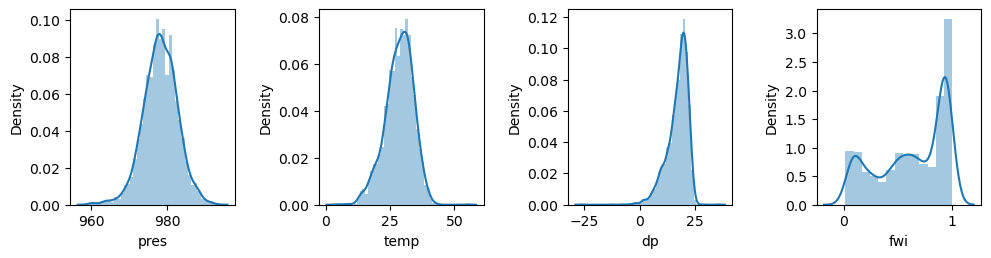
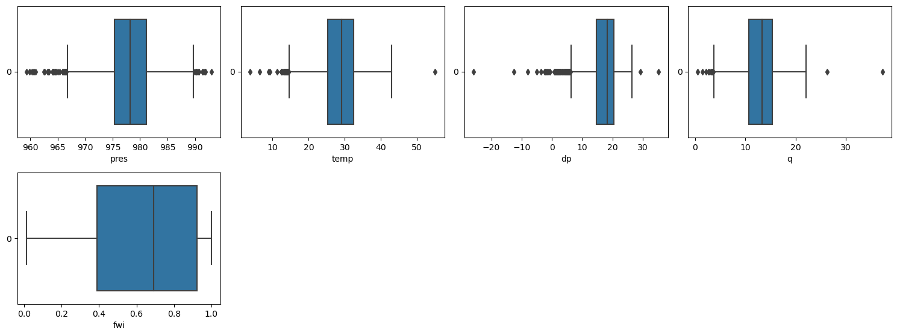
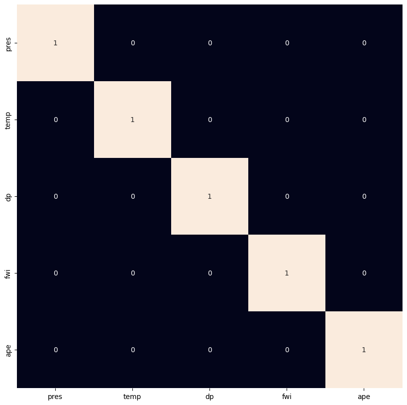

## My Project

Predicting Southern Great Plains Afternoon Precipitation Events
https://www.geeksforgeeks.org/rainfall-prediction-using-machine-learning-python/ 

***

## Introduction 

Here is a summary description of the topic. Here is the problem. This is why the problem is important.

- Rainfall forecasting important for these reasons: extreme weather events (e.g., hurricanes, rain- and snow-storms) often create dire situations (e.g., floods, landslides, and wildfires) causing severe economic losses and casualties. As global warming continues, the
frequency and intensity of extreme weather events are likely to increase in many regions (https://agupubs.onlinelibrary.wiley.com/doi/pdf/10.1029/2022GL097904) 
  
- Machine learning approach important for these reasons: existing models use complex statistical models that are often too costly, both computationally and budgetary, or are not applied to downstream applications (https://www.sciencedirect.com/science/article/pii/S266682702100102X)
  
- SGP hot spot for land-atmosphere interactions: Numerous studies have addressed the effect of soil moisture on
subsequent rainfall, yet consensus remains elusive (https://agupubs.onlinelibrary.wiley.com/doi/pdf/10.1029/2018GL078598) 

There is some dataset that we can use to help solve this problem. This allows a machine learning approach. This is how I will solve the problem using supervised/unsupervised/reinforcement/etc. machine learning.

- 

We did this to solve the problem. We concluded that...

## Data

Here is an overview of the dataset, how it was obtained and the preprocessing steps taken, with some plots!

- I used three products from the  U.S. Department of Energy’s Atmospheric Radiation Measurement (DOE ARM) Southern Great Plain (SGP) central facility (CF) and the region within a 50-km radius of the CF for the period of 2001-2019. The data is publically available at this website: https://www.arm.gov/data/. 

1) Product 1: SONDEWNPN
Description: Radiosonde balloon observations to obtain atmospheric surface variables. The variables of interest in this study were temperature, humidity, pressure and dewpoint.

2) Product 2: Oklahoma Mesonet Soil Moisture (OKMSOIL)
Description: Soil moisture measured by soil moisture sensors. The variable of interest in this study was fractional water index (FWI).

3) Product 3: Arkansas-Red Basin River Forecast Center (ABRFC)
Description: hourly gridded precipitation based on WSR-88D Nexrad radar precipitation estimates combined with rain gauge reports with extensive quality control (Fulton et al., 1998)


The preprocessing steps involved filtering each product such that I only extracted warm season (May - September) days between 2001-2019. I also colocated each product so that the soundings, precipitation and soil moisture files all exist within a 50km range of the ARM SGP Central Facility site. For every file in each product, I replaced missing data with NAN values and filtered all files such that I only kept the files that did not contain an excessive amount of missing information. For the precipitation product, I calculated an "afternoon precipitation event" (APE) as days in which afternoon precipitation was i) greater than morning and evening precipitation and ii) at least twice as much precipitation occurred in the afternoon than the morning. Below displays the code that calculated APEs:

```python
##precip_6_13 = total morning precipitation (between hours 6-13 LST)
##precip_14-20 = total afternoon precipitation (between hours 14-20 LST)
##precip_21_24 = total evening precipitation (between hours 21-24 LST)

pdf_time_ranges['APE'] = (pdf_time_ranges['precip_14_20'] > pdf_time_ranges['precip_6_13']) & \
                (pdf_time_ranges['precip_14_20'] > pdf_time_ranges['precip_21_24']) & \
                (pdf_time_ranges['precip_14_20'] > 2 * pdf_time_ranges['precip_6_13'])

pdf = pdf_time_ranges[['date','APE']]
```

Once each product was preprocessed and saved within its own dataframe, I joined all soundings, precipitation and soil moisture into one result dataframe. Since my result dataframe still contained arrays of atmospheric variables from the soundings (variables measured at interpolated pressure levels up to ~200hpa in the atmosphere), I extracted only the surface conditions. Finally, I plotted histograms, box plots and correlation heatmap of each feature in order to get a sense of the distributions of these variables. Figures 1 and 2 show the existence of ouliers within the feature variables. However, I chose to not remove them out of a scarcity of data. Figure 3 that q and dp are highly correlated. To remove the correlations in the model, I dropped q and kept dp.      

{: width="1000" }

*Figure 1: Histograms of each feature variable.*

{: width="1000" }

*Figure 2: Boxplots of each feature variable.*

{: width="500" }

*Figure 3: Correlation heatmap of each feature variable.*


## Modelling

Here are some more details about the machine learning approach, and why this was deemed appropriate for the dataset. 

In order to predict an afternoon precipitation event from morning land-surface and atmospheric conditions, I used a RandomForestClassifier from the Python SciPy package. This model was deemed most appropriate for this dataset for several reasons. First, the target variable was labeled which required a supervised model. The target variable also required a classification model because predictions would either fall under the True case (existence of an APE, "1") or False case (non-existence of APE, "0"). Finally, the RandomForestClassifier is less sensitive to outliers since it takes the average of many decision trees. Since the features contained outliers (as seen above in figure 2), this model could appropriately handle these inputs.    

The model might involve optimizing some quantity. You can include snippets of code if it is helpful to explain things.

After creating a train/test split of 80/20, it was also deemed appropriate to also use a random oversampler function (RandomOverSampler) because it was much more common that an APE did not occur (False case) than an APE did occur (True case). This function resamples the training data so that the RandomForestClassifier runs on training data that is balanced in True and False cases. 

```python
features = sfc_df.drop('ape', axis=1)
target = sfc_df.ape

X_train, X_test, y_train, y_test = train_test_split(features,
                                      target,
                                      test_size=0.2,
                                      stratify=target,
                                      random_state=2)
 
ros = RandomOverSampler(sampling_strategy='minority',
                        random_state=22)

X_resampled, y_resampled = ros.fit_resample(X_train, y_train)
```

Next, I leveraged a random search algorithm (RandomizedSearchCv) in order to tune the hyperparameters to identify the optimum max_depth and n_estimators. 

```python
param_dist = {'n_estimators': randint(50, 500),
              'max_depth': randint(1, 50)} 

rf = RandomForestClassifier()

rand_search = RandomizedSearchCV(rf, 
                                 param_distributions = param_dist, 
                                 n_iter=5, 
                                 cv=5)

rand_search.fit(X_resampled, y_resampled)

best_rf = rand_search.best_estimator_

print('Best hyperparameters:',  rand_search.best_params_)
```

This is how the method was developed.

## Results

After establishing the best random forest classifier determined by the optimum hyperparameters, I tested the models' accuracy. The accuracy ~75.6%. Next, I leveraged the feature_importances function to identify the ranking of feature importance for APEs. 


Figure X shows... [description of Figure X].

## Discussion

From Figure X, one can see that... [interpretation of Figure X].

## Conclusion

Here is a brief summary. From this work, the following conclusions can be made:
* first conclusion
* second conclusion

Here is how this work could be developed further in a future project.

## References
[[1] DALL-E 3]
(https://www.geeksforgeeks.org/rainfall-prediction-using-machine-learning-python/)https://www.geeksforgeeks.org/rainfall-prediction-using-machine-learning-python/

[back](./)

