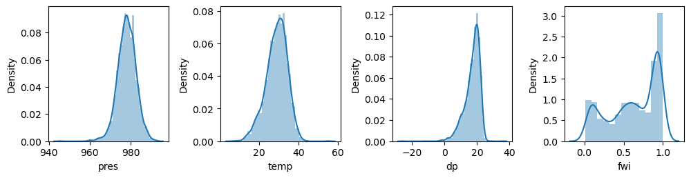

**Random Forest Classification of Southern Great Plains Afternoon Precipitation Events**


## Introduction 
Precipitation is a vital resource for daily human consumption, agricultural needs and industrial applications (Chen et al., 2022). Consequently, predicting the timing and amount of precipitation in specific regions is crucial for the development and maintenance of efficient infrastructure. Additionally, extreme weather events involving precipitation, such as hurricanes, rain and snow storms pose significant threats to infrastructure, human lives, and may lead to profound economic losses (Chen et al., 2022). Given the potential amplification of extreme events due to climate change in some places, accurate short-term and long-term rainfall forecasting becomes increasingly important for the management of infrastructure, economic resilience and the protection of human life.  

Traditionally, short-term rainfall predictions have relied upon numerical weather forecasting methods. However, numerical weather forecasting has posed challenges to accurate prediction such as large model uncertainties and extreme computational demands (Chen et al., 2022). Machine learning models are a useful alternative to conventional models for a few reasons. First, machine learning models offer a relatively inexpensive computational solution to prediction. Second, many models have the advantage of properly handling complex nonlinear relationships from historical data (Mao et al., 2020). Given the inherently nonlinear nature of precipitation processes, machine learning models present an opportunity to improve predictive precipitation capabilities. 

The Southern Great Plains (SGP) region of the United States is a location strongly influenced by land-atmosphere interactions particularly during the warm season months (May - September) (Myoung and NielsenGammon et al., 2010). However, the extent to which precipitation is influenced by soil moisture is not well understood (Welty et al., 2018). This study seeks to measure the relative importance of land-surface versus atmospheric features in dictating the presence afternoon precipitation in the SGP. Specifically, this study is designed to:

**1) Evaluate the predictive accuracy of a random forest classifier for predicting afternoon precipitation events (APEs) based on late morning atmospheric and soil moisture conditions.**

**2) Quantify the relative importance of soil moisture versus surface atmospheric properties in the prediction of APEs.**  


## Data
This study leveraged three products from the  U.S. Department of Energy’s Atmospheric Radiation Measurement (DOE ARM) Southern Great Plain (SGP) Central Facility (CF). The study region encompasses a 50-kilometer radius centered around the CF site. All products were filtered for the temporal range of 2001-2019 warm season months (May - September). The data is publically available at this website: https://www.arm.gov/data/. 

1) Product 1: SONDEWNPN
Description: Balloon-borne sounding system with significant quality applied to measurements. Surface temperature, humidity, pressure and dew point were extracted for every day in the specified temporal range. All observations used in this study were measured at 11:30 LST. This time was selected because it best represents the preconditions of afternoon convection (Wang et al., 2023). This product is available online here: https://www.arm.gov/capabilities/instruments/sonde. 

2) Product 2: Oklahoma Mesonet Soil Moisture (OKMSOIL)
Description: Soil moisture observations measured by surface soil moisture sensors. The variable of interest in this study is fractional water index (FWI), which ranges from 0 for very dry soil to 1 for saturated soil (Schneider et al., 2003). This product is available online here: https://www.arm.gov/capabilities/vaps/okmsoil.  

3) Product 3: Arkansas-Red Basin River Forecast Center (ABRFC)
Description: Hourly gridded precipitation based on WSR-88D Nexrad radar precipitation estimates combined with rain gauge reports with extensive quality control (Fulton et al., 1998). This product is available online here: https://www.arm.gov/capabilities/vaps/abrfc. 

The preprocessing steps involved filtering each product such that only warm season (May - September) days between 2001-2019 were extracted. Then, colocation between the soundings, precipitation, and soil moisture files ensured that all measured data used belonged within a 50-kilometer radius around the ARM SGP Central Facility site. While all radiosonde files originated from the same latitude and longitude pair (36.61,-97.49), OKMSOIL fractional water index is measured at over 100 different stations scattered across the Southern Great Plains region, and ABRFC precipitation is collected by satellite and thus extends across an even larger spatial domain. In order to colocate soil moisture with the sounding profiles, a single station located closest to the ARM SGP CF site was chosen. Precipitation was colocated with soundings (and the soil moisture station) by taking an average of daily precipitation across a 0.5 degree in both the latitude and longitude directions. Figure 1 below displays the colocation process. 

{: width="1000" }

*Figure 1: Colocation of sondewnpn radiosonde profiles with OKMSOIL and ABRFC products. The multicolored swath shows the ABRFC full domain and the blue patch indicates the ABRFC subdomain selected for this study*      

Once all products were temporally and geographically collocated, missing/incomplete or physically unrealistic data were filled with NAN values. Then, all files were filtered such that only the files that did not contain an excessive amount of missing information remained within this study.  

For the precipitation product, APEs were calculated as days with precipitation that satisfied the following criteria: i) afternoon precipitation was greater than both morning and evening precipitation and ii) at least twice as much precipitation occurred in the afternoon than the morning (Wang). The code sample below displays how APEs were determined using a conditional statement: 

```python
##precip_6_13 = total morning precipitation (between hours 6-13 LST)
##precip_14-20 = total afternoon precipitation (between hours 14-20 LST)
##precip_21_24 = total evening precipitation (between hours 21-24 LST)

pdf_time_ranges['APE'] = (pdf_time_ranges['precip_14_20'] > pdf_time_ranges['precip_6_13']) & \
                (pdf_time_ranges['precip_14_20'] > pdf_time_ranges['precip_21_24']) & \
                (pdf_time_ranges['precip_14_20'] > 2 * pdf_time_ranges['precip_6_13'])

pdf = pdf_time_ranges[['date','APE']]
```

Finally, I joined all soundings, precipitation and soil moisture data into a single dataframe. Since this result dataframe still contained arrays of atmospheric variables from the soundings, I extracted only the surface conditions (i.e. the first observation in each array since the radiosondes began taking measurements at ground level).  

Figures 2,3 and 4 below provide helpful visualizations of the characteristics of each feature variable used within this study. Figure 2 displays the distributions of each feature: the atmospheric features (pressure, temperature and dewpoint) were all somewhat normally distributed with slight left-skew. In contrast, the fractional water index shows a multimodal distribution. Boxplots of each feature in Figure 3 shows the existence of outliers for all atmospheric features. Figure 4 shows no significant correlations between any two features and consequently, all features listed remained within the model.       

{: width="1000" }

*Figure 2: Histograms of each feature variable.*

{: width="1000" }

*Figure 3: Boxplots of each feature variable.*

{: width="500" }

*Figure 4: Correlation heatmap of each feature variable.*


## Modeling
The random forest model, RandomForestClassifier() within the sklearn Python package, was deemed the most appropriate machine learning model to use in order to satisfy the objectives within this study. This model was selected for several seasons. First, the target variable was already labeled which required a supervised model. The target variable also required a classification model because predictions would either fall under the True case (existence of an APE, "1") or False case (non-existence of APE, "0"). Finally, the RandomForestClassifier is not particularly sensitive to outliers since it takes the average of many decision trees. Since the features contained outliers (as seen above in Figure 3), this model could appropriately handle the underlying data.      

After creating a train/test split of 80/20, it was also deemed appropriate to also use a random oversampler function (RandomOverSampler). Random sampling is often used for imbalanced datasets. Imbalanced data is defined data which contains a target variable with uneven distribution of observation types. For example, since it was much more common that an APE did not occur (False case) than an APE did occur (True case), oversampling was applied to redistribute this imbalance. The RandomOversampler within the imblearn Python pack resamples the training data so that the RandomForestClassifier runs on training data that is balanced in True and False cases. 

```python
features = sfc_df.drop('ape', axis=1)
target = sfc_df.ape

X_train, X_test, y_train, y_test = train_test_split(features,
                                      target,
                                      test_size=0.2,
                                      stratify=target,
                                      random_state=2)
 
ros = RandomOverSampler(sampling_strategy='minority',
                        random_state=22)

X_resampled, y_resampled = ros.fit_resample(X_train, y_train)
```

Next, I leveraged a random search algorithm (RandomizedSearchCv) in order to tune the hyperparameters to identify the optimum max_depth and n_estimators. 

```python
param_dist = {'n_estimators': randint(50, 500),
              'max_depth': randint(1, 50)} 

rf = RandomForestClassifier()

rand_search = RandomizedSearchCV(rf, 
                                 param_distributions = param_dist, 
                                 n_iter=5, 
                                 cv=5)

rand_search.fit(X_resampled, y_resampled)

best_rf = rand_search.best_estimator_

print('Best hyperparameters:',  rand_search.best_params_)
```


## Results
After establishing the best random forest classifier determined by the optimum hyperparameters, I tested the model accuracy by comparing the model predictions to observations from the test set. The accuracy was about 77.6%. Next, I calculated feature importances to identify the order of importance for features in determining an APE (Figure 5). Finally, I plotted a confusion matrix to categorize the true positive, false positive, true negative and false negative outputs of the model (Figure 6). 

{: width="1000" }

*Figure 5: Feature Importances for determining Afternoon Precipitation Events.*

{: width="1000" }

*Figure 6: Confusion Matrix of RandomForestClassifier.*


## Discussion

From Figure 5, one can see that the ranking of features in descending order is: temperature, dewpoint, pressure and fractional water index. While there is a slight descending order (or importance) for these features, they are all relatively ranked around the same importance (ranging from 0.26 - 0.24). Additionally, the confusion matrix (Figure 6) shows 344 True negative values, 73 False negative values, 14 True positive values and 30 False positive values.   


## Conclusion
From this work, the following conclusions can be made:

First, while the model performance appears to be somewhat successful around 77.6%, the performance is not particularly robust. Analyzing the confusion matrix clearly shows why this is the case. One can see that while the model was fairly successful in predicting the absence of APEs (True negatives vs False negatives), the model suffered in attempting to predict the presence of APEs (True positives vs. False positives). This is easy to see when comparing the ratios of: TN/TN+FP = .92 and TP/TP+FN = 0.16 (TN = True Negative, FP = False positive, TP = True positive, FN = False negative). Given the models' lack of robustness, the following conclusions must be understood under this context.

One can see there is no single feature that stands out as being particularly deterministic of APEs. This suggests the possibility that each of these features work in concert with one another and have relatively equal importance in determining afternoon rainfall. Additionally, one may conclude from Figure 4 that despite the importance of fractional water index, atmospheric surface variables are still stronger determining factors for afternoon precipitation. However, it is still noteable that fractional water index is similarly ranked with the atmospheric features. Thus, a conclusion can be drawn that precipitation in the Southern Great Plains region is almost nearly as determined by soil moisture conditions as surface level atmospheric variables. This conclusion may be reasonable given that the Southern Great Plains region is heavily impacted by land-surface interactions especially during the warm season months.  

To improve the accuracy of this model, future work involves including more common atmospheric features to precipitation prediction. Some of these variables include: wind speed, relative humidity and solar radiation. Additionally, I intend to experiment with how the model performance changes when using the average of measurements of atmospheric variables at different height intervals in the atmosphere, as opposed to only using surface conditions. I also intend to explore and compare the difference in performance with other machine learning models, particularly artificial neural networks. Artificial Neural Networks have recently become useful in weather and climate forecasting (Chantry et al., 2021; Schultz et al., 2021). ANNs are also successful at handling non-linear relationships within data and precipitation is inherently a highly nonlinear process. Additionally, ANNs can self-learn and successfully predict without knowing prior information about the relationship between variables in a system. In this way, ANNs may be a successful model choice because some small-scale physical processes of precipitation still are widely unknown (Kuligowski et al., 2022).

## References

Chen, Guoxing, and Wei‐Chyung Wang. “Short‐term precipitation prediction for contiguous United States using deep learning.” Geophysical Research Letters, vol. 49, no. 8, 2022, https://doi.org/10.1029/2022gl097904. 
Fulton, Richard A., et al. “The WSR-88D rainfall algorithm.” Weather and Forecasting, vol. 13, no. 2, 1998, pp. 377–395, https://doi.org/10.1175/1520-0434(1998)013&amp;lt;0377:twra&amp;gt;2.0.co;2. 
Harris, Lucy, et al. “A generative deep learning approach to stochastic downscaling of precipitation forecasts.” Journal of Advances in Modeling Earth Systems, vol. 14, no. 10, 2022, https://doi.org/10.1029/2022ms003120. 
Kuligowski, Robert J., and Ana P. Barros. “Experiments in short-term precipitation forecasting using artificial neural networks.” Monthly Weather Review, vol. 126, no. 2, 1998, pp. 470–482, https://doi.org/10.1175/1520-0493(1998)126&amp;lt;0470:eistpf&amp;gt;2.0.co;2. 
Mao, Yiwen, and Asgeir Sorteberg. “Improving radar-based precipitation nowcasts with machine learning using an approach based on random forest.” Weather and Forecasting, vol. 35, no. 6, 2020, pp. 2461–2478, https://doi.org/10.1175/waf-d-20-0080.1. 
“Rainfall Prediction Using Machine Learning - Python.” GeeksforGeeks, GeeksforGeeks, 5 June 2023, www.geeksforgeeks.org/rainfall-prediction-using-machine-learning-python/. 
Schneider, J. M., et al. “Spatiotemporal variations in soil water: First results from the ARM SGP CART network.” Journal of Hydrometeorology, vol. 4, no. 1, 2003, pp. 106–120, https://doi.org/10.1175/1525-7541(2003)004&amp;lt;0106:sviswf&amp;gt;2.0.co;2. 
Schneider, J. M., et al. “Spatiotemporal variations in soil water: First results from the ARM SGP CART network.” Journal of Hydrometeorology, vol. 4, no. 1, 2003, pp. 106–120, https://doi.org/10.1175/1525-7541(2003)004&amp;lt;0106:sviswf&amp;gt;2.0.co;2. 
Schultz, M. G., et al. “Can deep learning beat numerical weather prediction?” Philosophical Transactions of the Royal Society A: Mathematical, Physical and Engineering Sciences, vol. 379, no. 2194, 2021, p. 20200097, https://doi.org/10.1098/rsta.2020.0097. 
Wang, Gaoyun, et al. Influence of Lower Tropospheric Moisture on Local Soil Moisture-Precipitation Feedback over the U.S. Southern Great Plains, 2023, https://doi.org/10.5194/egusphere-2023-1897. 
Welty, J., and X. Zeng. “Does soil moisture affect warm season precipitation over the southern Great Plains?” Geophysical Research Letters, vol. 45, no. 15, 2018, pp. 7866–7873, https://doi.org/10.1029/2018gl078598. 
