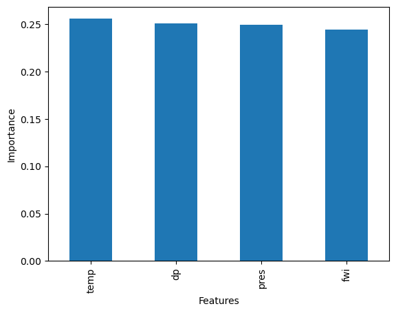

## 
Predicting Southern Great Plains Afternoon Precipitation Events
***

## Introduction 
Precipitation is used daily for human consumption, for agricultural needs and for industrial purposes (Chen). As such, understanding when and how much precipitation may fall in a particular region is necessary to build efficient infrastructure. Additionally, extreme weather events  involving rainfall such as hurricanes, rain and snow storms all threaten infrastructure, human lives, and may lead to profound economic losses (Chen). Additionally, as climate change may increase the likelihood of extreme events such as these in certain areas, rainfall forecasting will become even more critical in order to effectively manage of our infrastructure, economy and protect human life.  

Historically, short-term rainfall prediction was primarily done using numerical weather forecasting methods. But this approach has problems related to model uncertainties, and can no longer withstand the storage and computational needs required (Chen). Machine learning models offer a useful alternative to conventional models. First, machine learning models offer a relatively inexpensive computational solution to prediction. Additionally, many models have the advantage of properly handling complex nonlinear data relationships from historical data (Mao). Since precipitation is an nonlinear process, a machine learning model is a good choice for prediction.

The Southern Great Plains (SGP) region of the United States is a location strongly influenced by land-atmosphere interactions particularly during the warm season months (May - September) (Myoung and NielsenGammon, 2010). However, is not well understood the degree to which precipitation is determined by land surface as compared to atmospheric properties (Welty). In this study, I calculate the relative importance of land-surface versus atmospheric features in dictating afternoon precipitation events in the SGP. To this end, this study aims to accomplish these goals:

1) Determine the accuracy of a random forest classifier for predicting afternoon precipitation events (APEs) based on late morning atmospheric and soil moisture conditions.

2) Calculate the relative importance of soil moisture vs. surface atmospheric properties in predicting APEs.  

## Data
This study used three products from the  U.S. Department of Energy’s Atmospheric Radiation Measurement (DOE ARM) Southern Great Plain (SGP) central facility (CF) and the region within a 50-km radius of the CF for the warm season months (May - September) within the period of 2001-2019. The data is publically available at this website: https://www.arm.gov/data/. 

1) Product 1: SONDEWNPN
Description: Radiosonde balloon observations to obtain atmospheric surface variables. The variables of interest in this study were temperature, humidity, pressure and dewpoint. All profiles used in this study were measured at 11:30 LST. This time was selected because it best represents the preconditions of afternoon convection. 

2) Product 2: Oklahoma Mesonet Soil Moisture (OKMSOIL)
Description: Soil moisture measured by soil moisture sensors. The variable of interest in this study was fractional water index (FWI).

3) Product 3: Arkansas-Red Basin River Forecast Center (ABRFC)
Description: hourly gridded precipitation based on WSR-88D Nexrad radar precipitation estimates combined with rain gauge reports with extensive quality control (Fulton et al., 1998)

The preprocessing steps involved filtering each product such that I only extracted warm season (May - September) days between 2001-2019. I also colocated each product so that the soundings, precipitation and soil moisture files all exist within a 50km range of the ARM SGP Central Facility site. For every file in each product, I replaced missing data with NAN values and filtered all files such that I only kept the files that did not contain an excessive amount of missing information. For the precipitation product, I calculated an "afternoon precipitation event" (APE) as days in which afternoon precipitation was i) greater than morning and evening precipitation and ii) at least twice as much precipitation occurred in the afternoon than the morning. Below displays the code that calculated APEs:

```python
##precip_6_13 = total morning precipitation (between hours 6-13 LST)
##precip_14-20 = total afternoon precipitation (between hours 14-20 LST)
##precip_21_24 = total evening precipitation (between hours 21-24 LST)

pdf_time_ranges['APE'] = (pdf_time_ranges['precip_14_20'] > pdf_time_ranges['precip_6_13']) & \
                (pdf_time_ranges['precip_14_20'] > pdf_time_ranges['precip_21_24']) & \
                (pdf_time_ranges['precip_14_20'] > 2 * pdf_time_ranges['precip_6_13'])

pdf = pdf_time_ranges[['date','APE']]
```

Once each product was preprocessed and saved within its own dataframe, I joined all soundings, precipitation and soil moisture into one result dataframe. Since my result dataframe still contained arrays of atmospheric variables from the soundings (variables measured at interpolated pressure levels up to ~200hpa in the atmosphere), I extracted only the surface conditions. Finally, I plotted histograms, box plots and correlation heatmap of each feature in order to get a sense of the distributions of these variables. Figures 1 and 2 show the existence of ouliers within the feature variables. However, I chose to not remove them out of a scarcity of data. Figure 3 shows no significant correlations between any features and thus all features were kept in the model.      

{: width="1000" }

*Figure 1: Histograms of each feature variable.*

{: width="1000" }

*Figure 2: Boxplots of each feature variable.*

{: width="500" }

*Figure 3: Correlation heatmap of each feature variable.*


## Modelling

In order to predict an afternoon precipitation event from morning land-surface and atmospheric conditions, I used a RandomForestClassifier from the Python SciPy package. This model was deemed most appropriate for this dataset for several reasons. First, the target variable was labeled which required a supervised model. The target variable also required a classification model because predictions would either fall under the True case (existence of an APE, "1") or False case (non-existence of APE, "0"). Finally, the RandomForestClassifier is less sensitive to outliers since it takes the average of many decision trees. Since the features contained outliers (as seen above in figure 2), this model could appropriately handle these inputs.    

After creating a train/test split of 80/20, it was also deemed appropriate to also use a random oversampler function (RandomOverSampler) because it was much more common that an APE did not occur (False case) than an APE did occur (True case). This function resamples the training data so that the RandomForestClassifier runs on training data that is balanced in True and False cases. 

```python
features = sfc_df.drop('ape', axis=1)
target = sfc_df.ape

X_train, X_test, y_train, y_test = train_test_split(features,
                                      target,
                                      test_size=0.2,
                                      stratify=target,
                                      random_state=2)
 
ros = RandomOverSampler(sampling_strategy='minority',
                        random_state=22)

X_resampled, y_resampled = ros.fit_resample(X_train, y_train)
```

Next, I leveraged a random search algorithm (RandomizedSearchCv) in order to tune the hyperparameters to identify the optimum max_depth and n_estimators. 

```python
param_dist = {'n_estimators': randint(50, 500),
              'max_depth': randint(1, 50)} 

rf = RandomForestClassifier()

rand_search = RandomizedSearchCV(rf, 
                                 param_distributions = param_dist, 
                                 n_iter=5, 
                                 cv=5)

rand_search.fit(X_resampled, y_resampled)

best_rf = rand_search.best_estimator_

print('Best hyperparameters:',  rand_search.best_params_)
```

## Results

After establishing the best random forest classifier determined by the optimum hyperparameters, I tested the models' accuracy by comparing the models predictions to observations from the test set. The accuracy was about 75.6%. Next, I leveraged the feature_importances function to identify the ranking of feature importance for APEs (Figure 4). Finally, I used the sklearn confusion matrix module to categorize the true positive, false positive, true negative and false negative outputs of the model (Figure 5). 

{: width="1000" }

*Figure 4: Feature Importances for determining Afternoon Precipitation Events.*

{: width="1000" }

*Figure 5: Feature Importances for determining Afternoon Precipitation Events.*

## Discussion

From Figure 4, one can see that the most highly ranked feature in descending order is: temperature, dewpoint, pressure and fractional water index. While there is clearly a descending order (or importance) for these features, they are all relatively ranked around the same importance (ranging from 0.27 - 0.23). Additionally, the confusion matrix shows 360 True negative values, 76 False negative values, 19 True positive values and 46 False positive values.   

## Conclusion

From this work, the following conclusions can be made:

First, while the model performance appears to be somewhat successful around 75.6%, the performance is not particularly robust. Analyzing the confusion matrix clearly shows why this is this case. One can see that while the model was fairly successful in predicting the absence of APEs (True negatives vs False negatives), the model sufferred in attempting to predict the presence of APEs (True positives vs. False positives). This is easy to see when comparing the ratios of: TN/TN+FP = .89 and TP/TP+FN = 0.2 (TN = True Negative, FP = False positive, TP = True positive, FN = False negative). 

Given the models lack of robustness, the following conclusions must be understood under this context. Despite this, one can see there is no one feature that stands out as being particularly deterministic of APEs. This suggests the possibility that that each of these features work in concert with one another and have somewhat equal importance in determining afternoon rainfall. Additionally, once can conclude from Figure 4 that despite the importance of fractional water index, atmospheric surface variables are still stronger determining factors for afternoon precipitation. However, it is still noteable that fractional water index is similarly ranked with the atmospheric features. Thus, a conclusion can be drawn that precipitation in the Southern Great Plains region is almost nearly as determined by soil moisture conditions as surface level atmospheric variables. This conclusion is to be expected given that the SGP is a region heavily impacted by land-surface interactions especially during the warm season months.  

To improve the accuracy of this model, future work involves including more common atmospheric features to precipitation prediction. Some of these variables include: wind speed, relative humidity and solar radiation. Additionally, I intend to experiment with how the model performance changes when using the average of measurements of atmospheric variables at different height intervals in the atmosphere, as opposed to only using surface conditions. I also intend to explore and compare the difference in performance with other machine learning models, particularly artifical neural networks. Artifical Neural Networks have recently become useful in weather and climate forecasting (Chantry et al., 2021; Schultz et al., 2021). ANNs are also successful at handling non-linear relationships within data and precipitation is inherently a highly nonlinear process. Additionally, ANNs can self-learn and successfully predict without knowing prior information about the relationship between variables in a system. In this way, ANNs may be a successful model choice because while some small-scale physical processes of precipitation still are widely unknown (https://journals.ametsoc.org/view/journals/mwre/126/2/1520-0493_1998_126_0470_eistpf_2.0.co_2.xml?tab_body=fulltext-display#s2).

## References
[[1] DALL-E 3]
(https://www.geeksforgeeks.org/rainfall-prediction-using-machine-learning-python/)https://www.geeksforgeeks.org/rainfall-prediction-using-machine-learning-python/

https://journals.ametsoc.org/view/journals/mwre/126/2/1520-0493_1998_126_0470_eistpf_2.0.co_2.xml?tab_body=fulltext-display#s2 

https://agupubs.onlinelibrary.wiley.com/doi/full/10.1029/2022GL097904 

https://journals.ametsoc.org/view/journals/wefo/35/6/waf-d-20-0080.1.xml

https://agupubs.onlinelibrary.wiley.com/doi/pdf/10.1029/2018GL078598 

[back](./)

